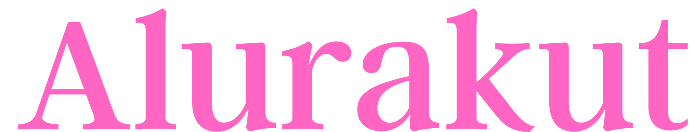
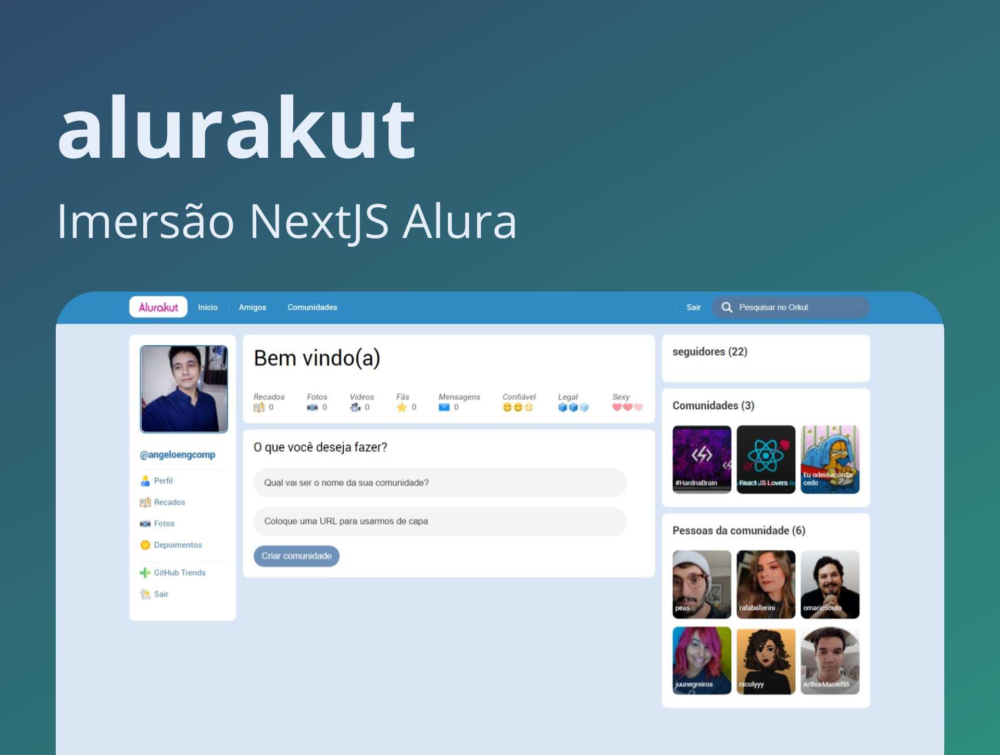

  

  

     

<h1 align="center">
    
</h1>

 

## 🧪 Tecnologias

Esse projeto foi desenvolvido com as seguintes tecnologias:

- ReactJS
- NextJS
- Versel
- DATO CMS
- Styled-Components
- JavaScript
- Figma

## 💻 Projeto

Alurakit é uma reimaginação da antiga rede social Orkut, nesta aplicação utilizamos NextJS como framework de desenvolvimento, Styled-Componentes para estilização dos componentes e DATO CMS para gerencimanto e criação das comunidades.

## 🔖 Deploy

Você pode visualizar o projeto aovivo através do link abaixo:

- [Website](https://alurakut-xi-ashen.vercel.app/) 

## 📝 License

Esse projeto está sob a licença MIT. Veja o arquivo [LICENSE](LICENSE.md) para mais detalhes.

---

